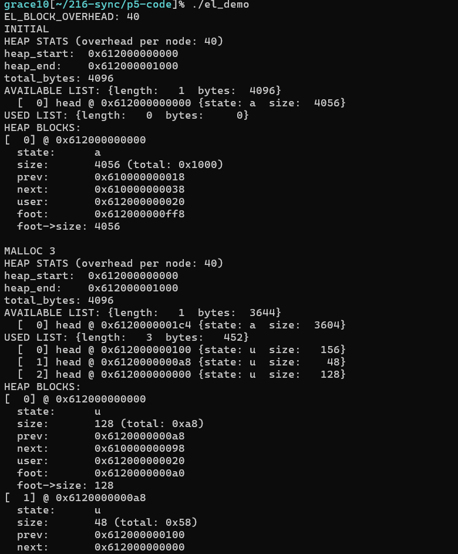
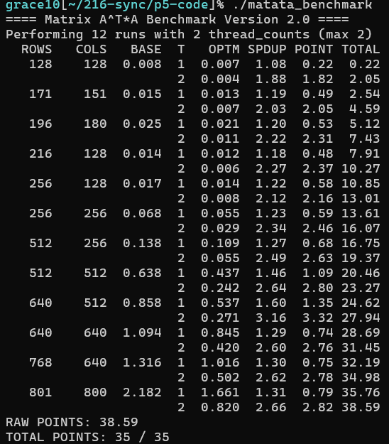
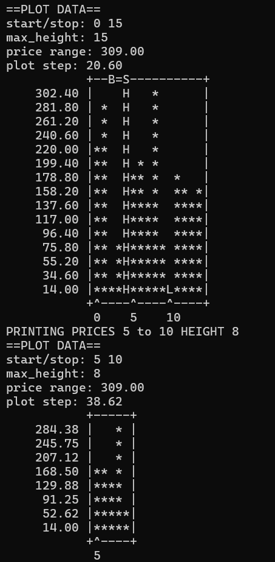

# Engineering Portfolio: Systems, Logic & Game Engines
### **Lanny | University of Maryland, Computer Science**

Welcome to my technical portfolio. This repository serves as a showcase for my engineering work across the software stack—from high-level game engine architecture in **Java** to low-level memory management and concurrency in **C** and **x86 Assembly**.

> [!IMPORTANT]
> **Note on Source Code:** Due to academic integrity policies and the proprietary nature of some projects, source code is maintained in private repositories. Detailed code walkthroughs or collaborator access can be provided upon request during the interview process.

---

## Project 1: BlockDrop 2D Game Engine
**Role:** Lead Systems Architect (Collaborative Project)

A robust, real-time puzzle engine built from scratch. I focused on the "Brain" of the game—the logic that handles how objects interact with the world and each other.

### **Core Engineering Feats**
* **Collision Matrix & Physics:** Implemented a 4-way collision system (Left, Right, Bottom, Stack) that validates movements against a 2D array representing the game board.
* **Geometric Transformations:** Integrated **Rotation Matrices** into the `Piece` class to handle 90-degree clockwise rotations around a dynamic anchor point.
* **State Machine Logic:** Designed a "Boss Piece" mechanic that monitors game state and triggers complex 3x3 block spawns at specific score thresholds.
* **Decoupled Rendering:** Utilized **Functional Mapping** to translate "Screen Space" coordinates to "World Space" logic, ensuring the physics remained independent of the framerate.

**Tech Stack:** `Java`, `AWT/Swing`, `Coordinate Geometry`, `State Design Pattern`

[Click here to watch the BlockDrop Demo](<assets/BlockDrop 2025-03-11 21-58-38.mp4>)

---

## Project 2: High-Performance Memory & Matrix Engine
**Role:** Sole Developer

A deep dive into systems programming, focusing on how software interfaces directly with CPU caches and the Operating System.

### **Core Engineering Feats**
* **Custom Memory Allocator (`el_malloc`):** Engineered a replacement for the standard C `malloc` using `mmap`. Managed the heap via a **Doubly-Linked List** of memory blocks with manual pointer arithmetic.
* **Fragmentation Control:** Implemented a **Coalescing Algorithm** to merge adjacent free blocks, significantly reducing heap fragmentation.
* **Cache-Aware Matrix Transpose:** Optimized matrix transformation algorithms by prioritizing **Spatial Locality**, reducing CPU cache misses and improving throughput.
* **Concurrency:** Leveraged **POSIX Threads (pthreads)** to parallelize matrix multiplication, distributing heavy data workloads across multiple CPU cores.

**Tech Stack:** `C (C11)`, `x86-64 Assembly`, `pthreads`, `mmap`, `Valgrind`, `GDB`

#### El_Malloc Demo

#### Benchmark Comparison Before and After Speedup

---

## Project 3: C-Data Visualizer
**Role:** Sole Developer

A data-driven application that parses complex financial datasets to provide actionable insights.

### **Core Engineering Feats**
* **Pattern Recognition:** Built logic to identify "Best Buy" and "Best Sell" windows within historical stock data.
* **Visual Rendering:** Translated raw numerical arrays into graphical representations, handling scaling and coordinate offsets in a C-based environment.

**Tech Stack:** `C`, `Data Modeling`, `Algorithms`

#### Sample Data Visualization

---

## 📫 Contact & Links
* **LinkedIn:** https://www.linkedin.com/in/yiyang-liu-55ba70255/
* **GitHub Status:** Private source code available upon request.
